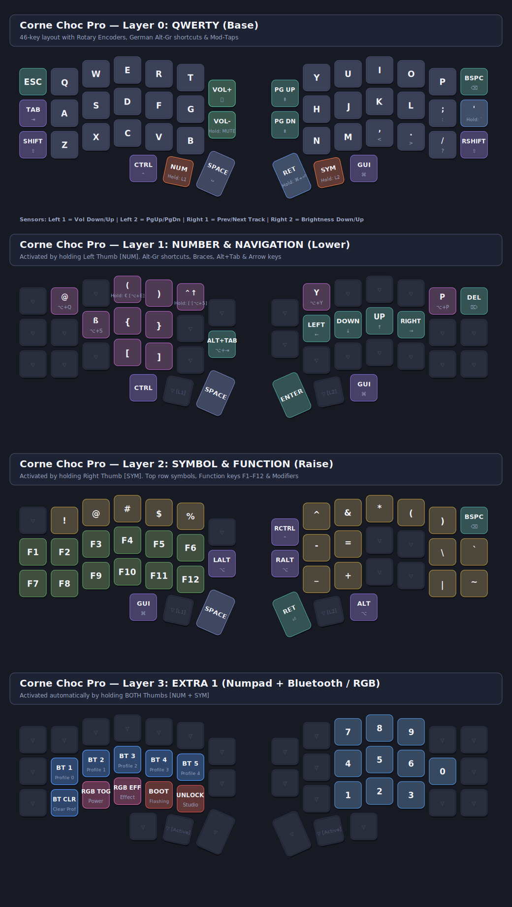
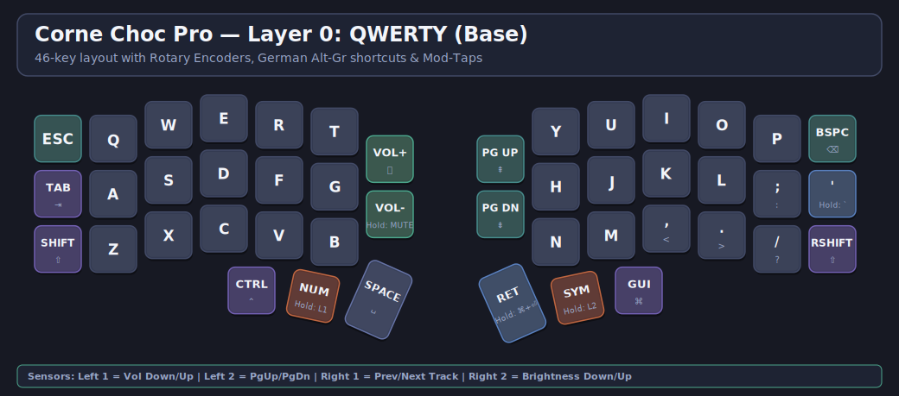
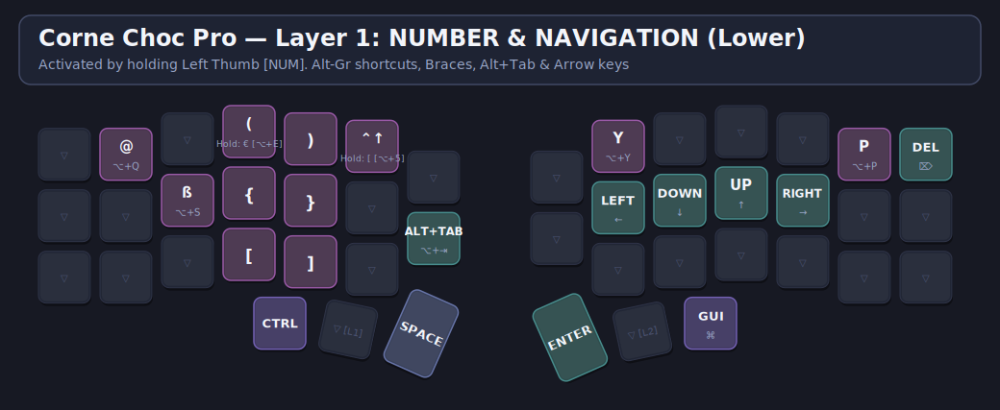
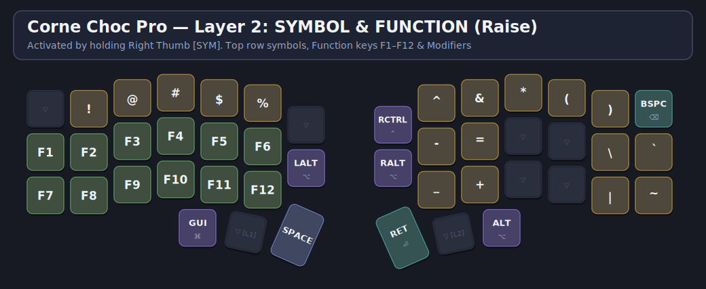
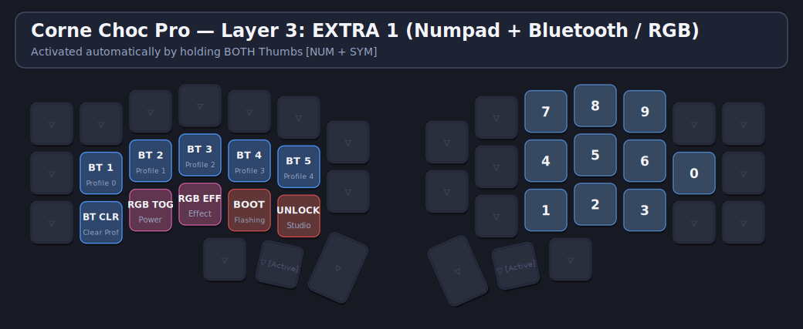
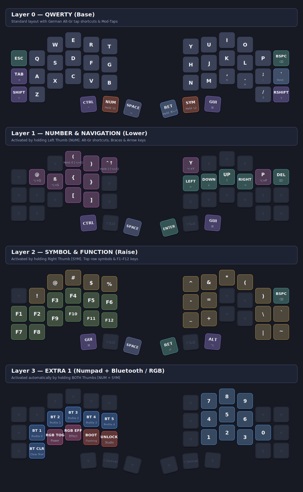
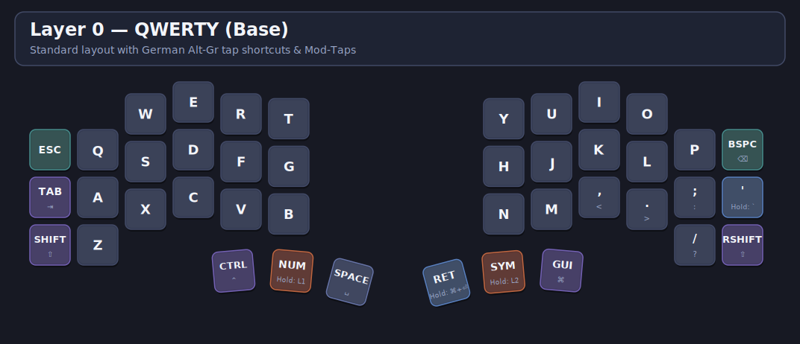
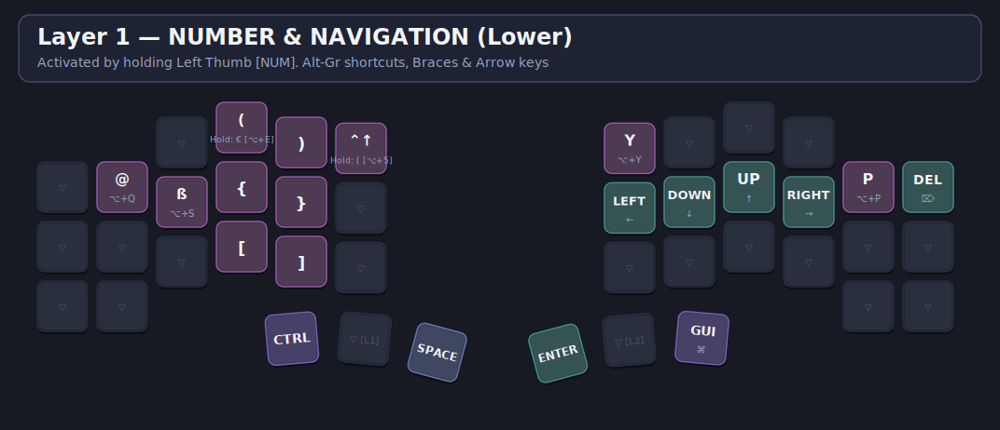
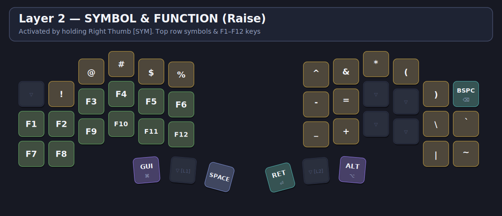
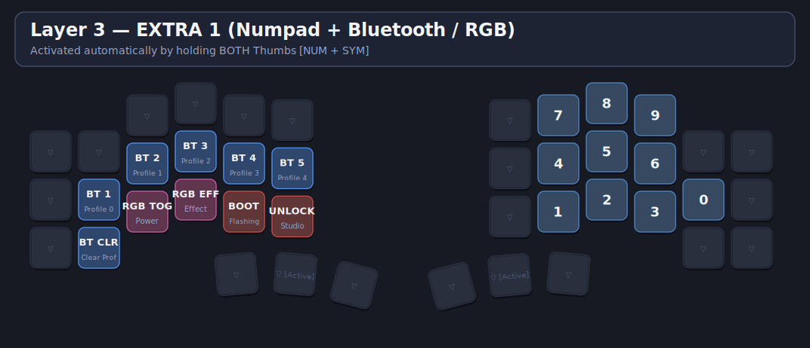

# Keyboard Layouts & Keymap Übersichten

In diesem Verzeichnis liegen die visuellen Layout-Grafiken (hochaufgelöste `.png`- und skalierbare `.svg`-Dateien) für die konfigurierten ZMK-Keyboards.

---

## 1. Corne Choc Pro BT (46 Tasten + 4 Encoder)

### Komplettübersicht


### Einzelne Layer
* **Layer 0 (QWERTY Base):**
  
* **Layer 1 (NUMBER & Navigation):**
  
* **Layer 2 (SYMBOL & Function):**
  
* **Layer 3 (EXTRA 1 - Numpad, Bluetooth, RGB):**
  

---

## 2. Piantor Pro BT (42 Tasten)

### Komplettübersicht


### Einzelne Layer
* **Layer 0 (QWERTY Base):**
  
* **Layer 1 (NUMBER & Navigation):**
  
* **Layer 2 (SYMBOL & Function):**
  
* **Layer 3 (EXTRA 1 - Numpad, Bluetooth, RGB):**
  

---

### Generierung
Alle Grafiken können jederzeit über das Skript neu gerendert werden:
```bash
python3 scripts/render_keymaps.py
```
